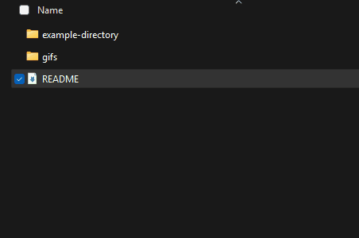

# **Tree-Based Data Visualization 🌳**

## **Overview**

This project is an **interactive treemap visualization tool** that represents **hierarchical data structures** using **recursive tree-based algorithms**. It was developed as part of **CSC148 at the University of Toronto**.

This program is designed to **visualize hierarchical data**, specifically focusing on **file system structures** by mapping folders and files into a treemap format.

🚨 **The full source code is private due to university policies and academic integrity concerns.**
If you're an employer or an interested party, please **contact me directly** for access.

## **Skills & Technologies Used**

✅ **Python & Object-Oriented Programming** – Implemented classes using **inheritance and abstraction**.\
✅ **Recursive Algorithms** – Used recursion to **traverse and process hierarchical data structures**.\
✅ **Data Processing** – Used **os library** to read and process **file system data**.\
✅ **Visualization with Pygame** – Implemented an **interactive GUI** to display treemaps dynamically.\
✅ **Event Handling & User Interaction** – Enabled users to **expand/collapse nodes, resize, move, and delete elements** in real-time.\
✅ **Algorithm Design** – Developed **treemap partitioning algorithms** to generate **proportional rectangular visualizations**.

## **Project Features**

### **📂 File System Visualization**

- Models **files and directories** as a tree structure.
- Uses **file sizes** to proportionally divide rectangles in the visualization.
- Enables **interactive expansion and collapsing** of directories.

### **🎨 Interactive Treemap Display**

- **Dynamic UI** that updates based on user input.
- Supports **clicking on elements** to display information.
- **Expanding & collapsing nodes** for flexible navigation.
- **Modifying & resizing elements** using keyboard commands.

## **Screenshots & Demo**

Below are some visuals demonstrating the system in action:

### **1️⃣ Example Directory Expansion & Collapse**

This GIF shows the user **expanding and collapsing nodes** in an example directory, representing a file system structure.


### **2️⃣ Treemap Visualization in Action**

This GIF demonstrates how the **treemap dynamically updates** as nodes are expanded and collapsed, showing how data is visually represented.


## **How to Run**

```sh
# Clone the repository
git clone https://github.com/Zain-Ghias/Tree-Based-Data-Visualization-Showcase.git
cd Tree-Based-Data-Visualization-Showcase

# Run the program (ensure dependencies are installed)
python src/treemap_visualiser.py
```

## **Why is the Code Private?**

- 🔒 This project was developed as part of **CSC148 at UofT**.
- 🚫 Keeping the code private prevents **academic integrity violations**.
- 🤝 If you're interested in the source code, **reach out to me directly.**

## **Contact**

📩 **Reach out via GitHub or LinkedIn!**

